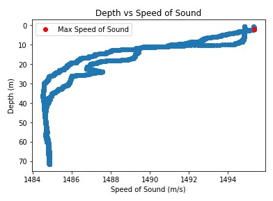
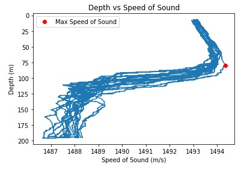
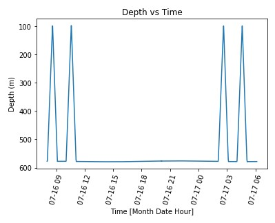
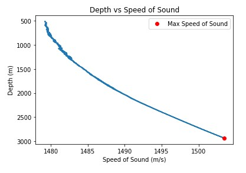
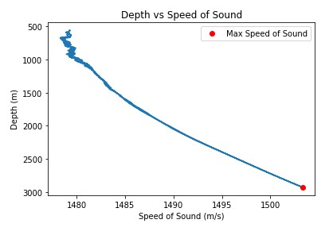
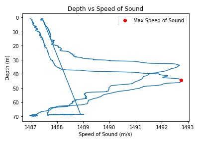

# Gary nguyen
# CTD Project
## A)Link To the Code file: 
[The Code](https://colab.research.google.com/drive/1guAe46VcQlW9cUdzwsCmEUx03yDrmLuo)
## B) Problem Statement:

## C) Results:
### 1.Oregon Shelf Surface Piercing Profiler Mooring
#### Depth vs Time
- Summer

	There is 1 dive on this date.
	
- Winter

	There are 9 dives on this date.

#### Speed of Sound vs Depth

- Summer

The Maximum Speed of Sound is 1500 m/s. 
The Average Speed of Sound is 1486 m/s

- Winter

The Maximum Speed of Sound is 1506 m/s. 
The Average Speed of Sound is 1483 m/s

### 2. Oregon Offshore Cabled Shallow Profiler Mooring
#### Depth vs Time
- Summer

There are 9 dives on this date.

- Winter

There are 9 dives on this date.

#### Speed of Sound vs Depth
- Summer

The Maximum Speed of Sound is 1506 m/s. 
The Average Speed of Sound is 1483 m/s

- Winter

The Maximum Speed of Sound is 1494 m/s. 
The Average Speed of Sound is 1490 m/s

### 3. Oregon Offshore Cabled Deep Profiler Mooring 
#### Depth vs Time

- Summer

	There is 2 dive on this date.
	
- Winter

	There are 2 dives on this date.

#### Speed of Sound vs Depth

- Summer

The Maximum Speed of Sound is 1482 m/s. 
The Average Speed of Sound is 1481 m/s

- Winter

The Maximum Speed of Sound is 1582 m/s. 
The Average Speed of Sound is 1481 m/s

### 4. Oregon Slope Base Shallow Profiler 
#### Depth vs Time

- Summer

	There is 12 dive on this date.
	
- Winter

	There are 9 dives on this date.

#### Speed of Sound vs Depth

- Summer

The Maximum Speed of Sound is 1484 m/s. 
The Average Speed of Sound is 1481 m/s

- Winter

The Maximum Speed of Sound is 1494 m/s. 
The Average Speed of Sound is 1489 m/s
### 5. Oregon Slope Base DeepProfiler
#### Depth vs Time

- Summer

	There is 2 dive on this date.
	
- Winter

	There are 2 dives on this date.

#### Speed of Sound vs Depth

- Summer

The Maximum Speed of Sound is 1503 m/s. 
The Average Speed of Sound is 1488 m/s

- Winter

The Maximum Speed of Sound is 1503 m/s. 
The Average Speed of Sound is 1487 m/s
### 6. Axial Base ShallowProfiler
#### Depth vs Time

- Summer

	There is 2 dive on this date.
	
- Winter

	There are 2 dives on this date.

#### Speed of Sound vs Depth

- Summer

The Maximum Speed of Sound is 1499 m/s. 
The Average Speed of Sound is 1484 m/s

- Winter

The Maximum Speed of Sound is 1499 m/s. 
The Average Speed of Sound is 1484 m/s
### 7. Axial Base Deep Profiler
#### Depth vs Time

- Summer

	There is 1 dive on this date.
	
- Winter

	There are 12 dives on this date.

#### Speed of Sound vs Depth

- Summer

The Maximum Speed of Sound is 1492 m/s. 
The Average Speed of Sound is 1488 m/s

- Winter

The Maximum Speed of Sound is 1484 m/s. 
The Average Speed of Sound is 1481 m/s

### Table of result:

### Answer Question:
1. Compare the number of dives per day of the shallow profiler vs deep profiler.
> Looking at the result talbe, we will compare number of dive with as a pair; Profiler 2 vs Profiler 3, 4 vs 5 and 6 vs 7. Almost, all the shallow profiler have a higher number of dive than the deep profiler during a 24hrs period. The reason could be because the travel distance is shorter for a several cases. However, their velocity could be controled, so it is not really proof for it.
2. Where is the maximum value of ssp in each season? Explain why the max ssp should be there?
> All maximum value is show in the Table of result. For peofilers have the depth  from surfave to around 1000m, the maximum speed of sound is normally is as the near surface as much as possible. The reason for that is sound travel faster as the higher temperater, and near the surface with more heat from sun and lands gives a better conditions for sounds travel. That is also the reason for maximum value appears at higher aplitude (closer to the surdace) in the summer than during winter. However, for profiler have the depth higher than 1000, their maximum speed of sound appear at the at bottom of the graph. Because temperature at the bottom of the ocean is nearly constant, there is no affect from surface and seasons. Instead of that, pressure is significant high at this aplitude. Therefore, as deeper they go the higher speed of sound.
3. Compare the ssp profile in day and night of all profilers, explain what you find(effect of day vs night).
> **As dicussed above, because of the significant impact of the temperater close the surface, ssp profiler during the day has higher maximum speed of sound and the height of minimum speed of sound appear at the deeper in the ocean comparing for night time profiler. During the day, heat from the sun and the land make the top layer of the ocean have higher temperater, and that makes the speed of sound travel faster. As the same time, that heated layer is thicker, that makes the layer has minimum speed of sounds go down deeper into the ocean. On the other hand, with profilers have deep around 2500m, day or night don't affect the shape of the profiler. Because top heated layer is around 100m to 200m, it is to small compared to 2500m. Even though, their is effects of day or night, it doesn't show up clear in the graph.
4. Compare the ssp profile in summer and winterof all profilers, explain what you find(effect of season). 
> 
## D) Conclusion
