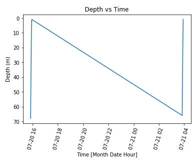

# Gary nguyen
# CTD Project
## A)Link To the Code file: 

## B) Problem Statement:

## C) Results:
### 1.Oregon Shelf Surface Piercing Profiler Mooring
#### Depth vs Time
- Summer

There is 1 dive on this date.
