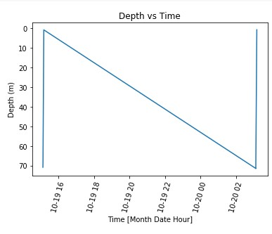
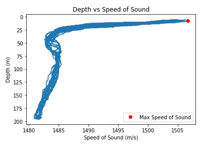
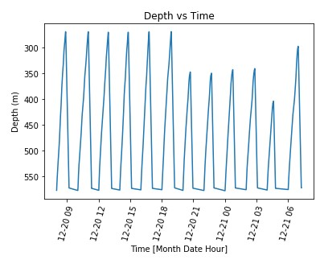
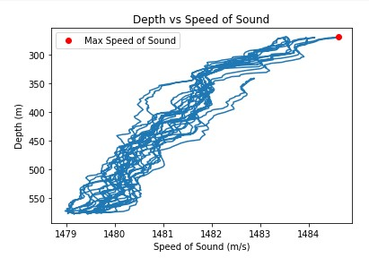
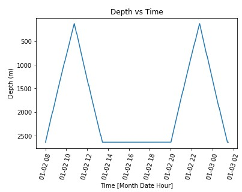
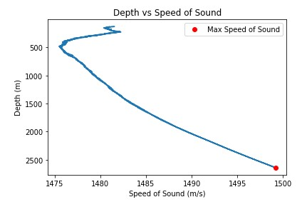

# Gary nguyen
# CTD Project
## A) Link To the Code file: 
[The Code](https://colab.research.google.com/drive/1guAe46VcQlW9cUdzwsCmEUx03yDrmLuo)
## B) Problem Statement:

## C) Results:
### 1.Oregon Shelf Surface Piercing Profiler Mooring
#### Depth vs Time
- Summer

	There is 1 dive on this date.
	
- Winter

	There are 9 dives on this date.

#### Speed of Sound vs Depth

- Summer

The Maximum Speed of Sound is 1500 m/s. 
The Average Speed of Sound is 1486 m/s

- Winter

The Maximum Speed of Sound is 1506 m/s. 
The Average Speed of Sound is 1483 m/s

### 2. Oregon Offshore Cabled Shallow Profiler Mooring
#### Depth vs Time
- Summer

There are 9 dives on this date.

- Winter

There are 9 dives on this date.

#### Speed of Sound vs Depth
- Summer

The Maximum Speed of Sound is 1506 m/s. 
The Average Speed of Sound is 1483 m/s

- Winter

The Maximum Speed of Sound is 1494 m/s. 
The Average Speed of Sound is 1490 m/s

### 3. Oregon Offshore Cabled Deep Profiler Mooring 
#### Depth vs Time

- Summer

	There is 2 dive on this date.
	
- Winter

	There are 2 dives on this date.

#### Speed of Sound vs Depth

- Summer

The Maximum Speed of Sound is 1482 m/s. 
The Average Speed of Sound is 1481 m/s

- Winter

The Maximum Speed of Sound is 1582 m/s. 
The Average Speed of Sound is 1481 m/s

### 4. Oregon Slope Base Shallow Profiler 
#### Depth vs Time

- Summer

	There is 12 dive on this date.
	
- Winter

	There are 9 dives on this date.

#### Speed of Sound vs Depth

- Summer

The Maximum Speed of Sound is 1484 m/s. 
The Average Speed of Sound is 1481 m/s

- Winter

The Maximum Speed of Sound is 1494 m/s. 
The Average Speed of Sound is 1489 m/s
### 5. Oregon Slope Base DeepProfiler
#### Depth vs Time

- Summer

	There is 2 dive on this date.
	
- Winter

	There are 2 dives on this date.

#### Speed of Sound vs Depth

- Summer

The Maximum Speed of Sound is 1503 m/s. 
The Average Speed of Sound is 1488 m/s

- Winter

The Maximum Speed of Sound is 1503 m/s. 
The Average Speed of Sound is 1487 m/s
### 6. Axial Base ShallowProfiler
#### Depth vs Time

- Summer

	There is 2 dive on this date.
	
- Winter

	There are 2 dives on this date.

#### Speed of Sound vs Depth

- Summer

The Maximum Speed of Sound is 1499 m/s. 
The Average Speed of Sound is 1484 m/s

- Winter

The Maximum Speed of Sound is 1499 m/s. 
The Average Speed of Sound is 1484 m/s
### 7. Axial Base Deep Profiler
#### Depth vs Time

- Summer

	There is 1 dive on this date.
	
- Winter

	There are 12 dives on this date.

#### Speed of Sound vs Depth

- Summer

The Maximum Speed of Sound is 1492 m/s. 
The Average Speed of Sound is 1488 m/s

- Winter

The Maximum Speed of Sound is 1484 m/s. 
The Average Speed of Sound is 1481 m/s

### Table of result:

## D) Conclusion

### Answer Question:
1. Compare the number of dives per day of the shallow profiler vs deep profiler.
> Looking at the result table, we will compare number of dives with as a pair; Profiler 2 vs Profiler 3, 4 vs 5 and 6 vs 7. Almost, all the shallow profiler have a higher number of dive than the deep profiler during a 24hrs period. The reason could be because the travel distance is shorter for several cases. However, their velocity could be controlled, so it is not really proof for it.
2. Where is the maximum value of ssp in each season? Explain why the max ssp should be there?
> All maximum value is shown in the Table of results. For profilers have the depth  from surface to around 1000m, the maximum speed of sound is normally as the near surface as much as possible. The reason for that is sound travel faster as the higher temperature, and near the surface with more heat from the sun and lands gives a better conditions for sounds travel. That is also the reason for maximum value appears at higher amplitude (closer to the surface) in the summer than during the winter. However, for profiler have the depth higher than 1000, their maximum speed of sound appear at the bottom of the graph. Because the temperature at the bottom of the ocean is nearly constant, there is no effect from surface and seasons. Instead, pressure is significant high at this amplitude. Therefore, as deeper they go the higher speed of sound.
3. Compare the ssp profile in day and night of all profilers, explain what you find(effect of day vs night).
> As discussed above, because of the significant impact of the temperature close to the surface, ssp profiler during the day has higher maximum speed of sound and the height of minimum speed of sound appear at the deeper in the ocean comparing for night time profiler. During the day, heat from the sun and the land make the top layer of the ocean have higher temperature, and that makes the speed of sound travel faster. At the same time, that heated layer is thicker, which makes the layer has minimum speed of sounds go down deeper into the ocean. On the other hand, with profilers have deep around 2500m, day or night don't affect the shape of the profiler. Because top heated layer is around 100m to 200m, it is too small compared to 2500m. Even though, their is effects of day or night, it doesn't show up clear in the graph.
4. Compare the ssp profile in summer and winter of all profilers, explain what you find (effect of season). 
> As stated in the answer for question 2, the maximum points appear at closer to the surface than during the winter because of the effect of temperature and higher salinity. However, the speed of sound drop dramatically when going down around 20-30m from the maximum point, because the effect from sum is effective only a thin layer of water. That is because light doesn't travel far down to the ocean. In the winter, the difference of speed of sound in the first layer is a little bit shorter, because the differences of the temperature is not huge compared to summer season. With profiler have greater deep, there is not a lot of differences between summer and winter, because at around 1500m below the surface, sun for surface doesn't affect the ocean temperature anymore.
5. Compare the average ssp profiles of all profilers recorded at the same day in winter and summer (effect of location).
> Because the complicated of the new language coding, I haven't learned enough to process this task. However, the result should be similar with we discussed above.

### Personal Reflect.

> This project is a great opportunity for us to learn so many different things. Through this project, I learn how layer of ocean behaviour by the changing of the temperature. At the same time, the relationship between temperature, salinity, pressure and speed of sound are showed clearly via figures from profiler. Other than that, we have learned coding in a new language in a short few days. Python is really common and helpful for us in the future, so this is a great opportunity to learn it.

> However, as a new language, Python is really different with Mathlab as we have learned before. I was really stressed while learning and working on the project as the same time. Because of overwhelming of the task, I didn't manage to finish it all. It could be better if we have a little bit more time to learn about Python before, as some of my classmates. Moreover, the website that we get the data sometimes gives really weird data, so it messed up some of my graph. That causes a little trouble to analyze the data for me. Overall, I have learned a lot from this project, and there are a lot of things that I can improve.

